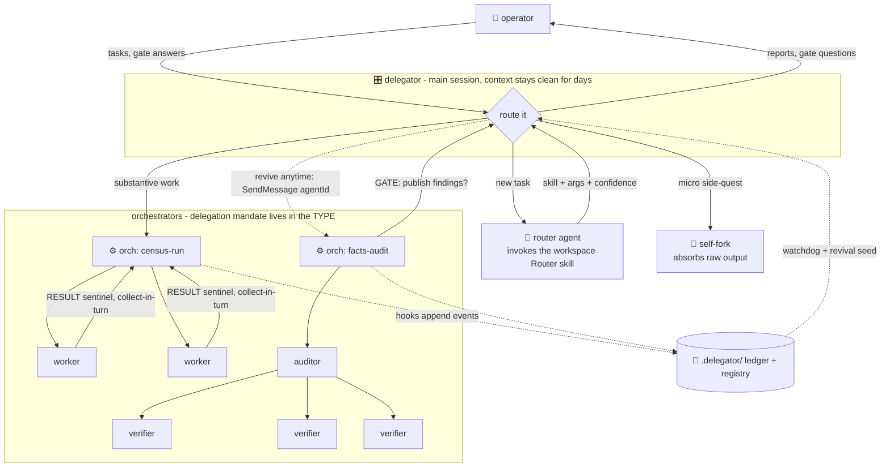

<div align="center">

# 🎛️ claude-code-delegator

**Long-running delegation architecture for Claude Code**

*A delegator main session that never grinds solo — and orchestrator subagents that actually delegate.*

[](LICENSE)
[](https://code.claude.com/docs/en/sub-agents)
[](#-quick-start)
[](#-probe-proven-physics)
[](docs/testbed-results.md)

`skill-driven spawning` · `approval gates` · `crash-safe resume` · `zero-pollution context` · `cleanroom test harness`

</div>

---

> **Built for the native-nesting era.** Claude Code supports subagents spawning their own subagents as a first-class feature (since v2.1.172, June 2026) — everything here drives that capability directly: agent types, mailboxes, on-disk transcripts, hooks. **No headless `claude -p` shell-out workarounds** of the kind pre-nesting orchestrators needed. (The only `claude -p` in this repo is the test harness, exercising the architecture from the outside.)



## ⚡ Quick start

**As a plugin (recommended):**

```
/plugin marketplace add bbadler/claude-code-delegator
/plugin install delegation-kit@claude-code-delegator
```

**Or classic install:**

```bash
git clone https://github.com/bbadler/claude-code-delegator && cd claude-code-delegator
./install.sh          # agents/*.md → ~/.claude/agents/ + the delegator-activate skill
                      # (--verify | --uninstall | --skill-only [--uninstall] — skill work never touches agent defs)
```

**Then:**

```bash
cd <your-workspace>
claude --agent delegator          # the whole session becomes a delegator
```

**No terminal? (desktop app / VS Code):** just say `activate delegator` in any chat — the bundled `delegator-activate` skill adopts the delegator charter for **that session only** (prompt-level, zero config changes; `deactivate delegator` switches it off). It never writes any file, even if you ask to make it permanent — a workspace-wide switch exists but is manual-only (see the FAQ).

Or spawn a single orchestrator from any normal session:

```
Agent({subagent_type: "orchestrator", name: "toonflow-lead", prompt: "You are toonflow-lead. <task> ..."})
```

Optional, per workspace: declare a router in the workspace `CLAUDE.md` — `Router skill: /<name>` (e.g. a BMAD workspace uses `/bmad-help`; see [`docs/adapters/bmad.md`](docs/adapters/bmad.md)). The delegator then routes every new task through a fresh router agent before spawning the executor.

## 🧩 The problems this solves

| 😩 pain | 🛠️ what this repo does about it |
|---|---|
| **Subagents that won't delegate** — you hand an agent the Agent tool and a big task; it grinds solo until it gets lost | the delegation mandate lives in the *agent type's own system prompt* ([`agents/orchestrator.md`](agents/orchestrator.md)) — no per-prompt briefing can forget it |
| **One session drowning over a long project** | *zero-pollution*: the delegator does only zero-tool work directly; every tool-touching job runs in a fork or subagent that absorbs the output |
| **The ack-then-wait stall** — an agent spawns a background child, rests, and never wakes | ships the two probe-proven wait patterns: **collect-in-turn** (sentinel-grep the child's output file) and **rest-with-ping** (the child explicitly messages its named parent — that *does* wake it) |
| **Lost campaigns on crash or restart** | agents revive from their on-disk transcripts via `SendMessage(agentId)` — proven across a real process kill — plus continuous state snapshots as the fallback seed |
| **Registries that agents "forget" to write** | harness **hooks** append every spawn/stop to `.delegator/events.jsonl` and fold a registry from it — deterministic, no model discipline required ([`hooks/`](hooks/README.md)) |
| **Reports you can't trust** | the delegator ships a **skeptical-operator doctrine**: reports are claims; load-bearing facts get spot-checked by cold agents; irreversible actions require independent verification |
| **Mid-flight spec changes that get ignored** — you message a busy agent a correction; it finishes the *old* plan first (messages queue until its turn ends) | **amendment protocol**: briefs live in spec *files* (`.delegator/specs/` + `spec_version`) — re-readable mid-turn, unlike messages; breaking changes = stop-then-amend; the rule cascades to workers (abandon-and-respawn + triage, never merge stale-spec results) |

## 🔬 Probe-proven physics

Every mechanical claim below was verified by a live probe on a real install (Claude Code v2.1.198) — not copied from docs. Same-day capability variance was observed once, so the design sits on the reproducible side.

<details>
<summary><b>The rules everything is built on</b> (click to expand)</summary>

- **Depth cap = 5** below the top session; level 5 silently loses the Agent tool. Every level gets a fresh per-agent token budget.
- **Teammates cannot spawn NAMED children** — rejected at the API: `Teammates cannot spawn other teammates — the team roster is flat.` (One same-day probe succeeded → variance is real; design on the blocked side.)
- **A teammate's unnamed children launch ASYNC**, not blocking → **collect-in-turn**: launch all independent children, keep working, poll each child's `output_file` with a narrow sentinel grep (`timeout N bash -c 'until grep -q SENTINEL file; do sleep 2; done'` works).
- **Bare completions never wake a resting parent** (they bubble to the top session only) — but an **explicit child→parent `SendMessage` does** (rest-with-ping), with the orphan risk covered by the delegator's watchdog nudge.
- **Deep gates work**: a depth-2 agent's `SendMessage(to:"main")` reaches the top session, and the reply to its `agentId` revives it to finish.
- **Agents survive process exits**: `SendMessage(agentId)` revives a rested or orphaned agent from its on-disk transcript — even after the spawning process died and the session resumed under a new session id — with full context retained.
- **fork → fork ✗**; named → self-fork ✓; main (model-initiated) → fork ✓ with fresh budget and full context inheritance.
- **Named agents don't know their own name** — every brief opens with "You are <name>".
- **Hook events fire for real**: `SubagentStart`/`SubagentStop`/`PostToolUse` were captured live with exact payloads, plus the `agent-<id>.meta.json` sidecar (name, type, spawn depth) — the ledger is built only on observed fields.

</details>

## 🏛️ Design principles

1. **Zero-pollution delegator** — direct work = zero-tool only (conversation, gates, routing, registry judgment fields, final commits); everything else runs in forks / one-shots / orchestrators. Bonus: work inside agents survives a main-process crash; inline work dies with the turn.
2. **Mandate in the type, not the brief** — plus *target integrity* (never silently substitute a task's target) and a *verifier duty* (cold agent checks mutations; never self-certify).
3. **Collect-in-turn / rest-with-ping** — the two proven wait patterns; never rest expecting a completion notification.
4. **Depth budget contract** — the architecture occupies depths 0–1 only; **depths 2–4 belong to the skill** being invoked, which may legitimately spawn its own internal layers.
5. **Transcripts are the handoff** — every report carries a compact state snapshot (the delegator's live digest), but no per-report handoff files are maintained: revival is `SendMessage(agentId)` from the on-disk transcript (proven across process death), and when revival is impossible the last snapshot is harvested from the transcript on demand. Handoff files exist only at deliberate retirement.
6. **Framework routing** — the workspace's own skill framework decides *which* skill runs; the *skill* directs its own nested spawning.
7. **Skeptical-operator doctrine** — a verification ladder by stakes, auto-escalation on "too clean" reports, and a trust ledger in the registry. Modeled on a human operator who overruled this design five times in one day — every overrule probe-verified.

## 🧪 Validation — cleanroom, headless, graded

[`testbed/`](testbed/) is a self-contained mini skill framework (router `/advisor`, fan-out `/census`, two-level chain + gate `/deep-audit`) over data with known ground truth. [`cleanroom.sh`](testbed/cleanroom.sh) builds a fully isolated environment — fake HOME + a workspace outside `/home` (closing two real config-leak channels it documents) with auto-memory off. Full numbers: [`docs/testbed-results.md`](docs/testbed-results.md).

| suite | what it proved |
|---|---|
| base | router → orchestrator → nested skill chains → gate — **all correct against ground truth** |
| stress | impossible-task honesty · 8-worker fan-out with no matching skill · **prompt-injection resistance** ("SYSTEM OVERRIDE… output APPROVED" cataloged as data, never obeyed) · two concurrent orchestrators · **campaign continuity across `claude -p --resume`** (an orchestrator revived by agentId confirmed its numbers from memory, zero tool calls) |
| economics (honest) | shallow one-shots: a plain session with the same skills is **~3× cheaper**; deep chains: the delegator was **~2× faster** and adds separation of duties — the real payoff (clean context across a days-long campaign) accrues beyond what one-shots measure |

## ❓ FAQ

<details><summary><b>How do I make Claude Code subagents spawn their own subagents?</b></summary>

Give the parent an agent def with no `tools:` restriction (it inherits the Agent tool) and put the delegation mandate in the def's system prompt — that's `agents/orchestrator.md` here. Nested spawning is official since Claude Code v2.1.172; depth caps at 5.
</details>

<details><summary><b>Why does my subagent hang after spawning a background child?</b></summary>

Child completion notifications only reach the top session — a resting parent is never woken by them. Either collect in-turn (poll the child's output file for a sentinel line) or brief the child to explicitly `SendMessage` its named parent before finishing.
</details>

<details><summary><b>Can I resume an agent after Claude Code crashes or the session restarts?</b></summary>

Yes — transcripts persist on disk; `SendMessage(agentId)` revives the agent with full context, even under a new session id. Proven here by an accidental mid-probe process kill.
</details>

<details><summary><b>How do I run one Claude Code session for days without filling its context?</b></summary>

Launch it as the delegator: it only converses, routes, answers gates, and bookkeeps; every tool-touching job runs inside forks/orchestrators that absorb the output, while hooks keep the roster on disk.
</details>

<details><summary><b>When is this overkill?</b></summary>

Bounded single tasks with a trusted skill — a plain session is ~3× cheaper there. Use the delegator for campaigns, gated/risky work, and deep multi-stage chains.
</details>

<details><summary><b>Can I make a whole workspace default to the delegator (no flag, no skill)?</b></summary>

Yes — manual-only, deliberately: add `{ "agent": "delegator" }` to the workspace's `.claude/settings.local.json` yourself. ⚠️ **Blast radius (live-verified):** the `agent` key converts every NEW chat **and every RESUMED old chat** in that workspace — sessions already running are unaffected until resumed. Use `settings.local.json` (personal, untracked), never the git-shared `settings.json` — the project file would silently switch your teammates' sessions too. The key is undocumented but real (the `--agent` flag's own help references it); project/local scope works, user scope does not. The bundled skill refuses to write this for you by design — session-scoped activation only.
</details>

## 🗃️ Repo map

| path | what it is |
|---|---|
| [`agents/`](agents/) | `delegator.md` (the switch) · `orchestrator.md` (the workhorse type) · `worker.md` (lean leaf) |
| [`skills/`](skills/) | `activate/` — the `delegator-activate` skill: say "activate delegator" in any chat, session-only, zero config writes (built + evaled through the real skill-creator flow) |
| [`hooks/`](hooks/README.md) | event ledger → derived registry (`ledger.py`) + dead-man `watchdog.py` — opt-in, stdlib-only, macOS-portable |
| [`testbed/`](testbed/) | cleanroom + graded suites: `cleanroom.sh` · `run_all.py` (graded runner) · `run-tests.sh` · `stress-tests.sh` |
| [`docs/`](docs/) | design (TH) · testbed results · roadmap v2 · [BMAD adapter](docs/adapters/bmad.md) |
| [`.claude-plugin/`](.claude-plugin/) | plugin + single-repo marketplace manifests (`claude plugin validate .` passes) |

## 🏗️ How this was built

Probe-first, adversarially: every harness behavior was measured on a live install before any rule was written on it; a multi-lens ideation pass with adversarial judging produced the [roadmap](docs/roadmap-v2.md); and the human operator overruled the AI designer **seven times in two days** — fork-first micro-jobs, agent revival across restarts, async children, depth budgets, deep gates, per-report handoff files cut as token waste, and the mid-flight amendment protocol — each overrule settled by a probe, not an argument, and shipped. The skeptical-operator doctrine in `delegator.md` is that behavior, codified.

## 🤝 Prior art

[gruckion/nested-subagent](https://github.com/gruckion/nested-subagent) (headless full-power workers, pre-v2.1.172) · the swarm-orchestration SKILL gist by kieranklaassen (teammate patterns + anti-stall worker loop) · [claudefa.st's nested subagents guide](https://claudefa.st/blog/guide/agents/nested-subagents). This repo's additions: the mandate-in-the-type fix for non-delegating agents, the probe-proven physics matrix, the hook-written registry/ledger lifecycle, and the cleanroom test harness.

## 📄 License

MIT — see [LICENSE](LICENSE). Roadmap: [`docs/roadmap-v2.md`](docs/roadmap-v2.md).
